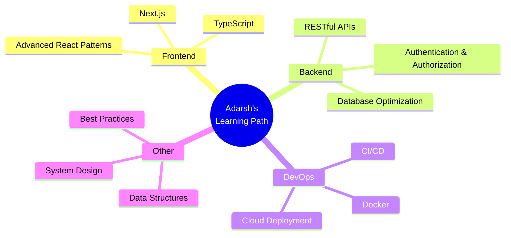

# 👋 Hi there, I'm Adarsh Yadav!

<div align="center">
  
[](https://git.io/typing-svg)

[](https://www.linkedin.com/in/adarsh-yadav9)
[](https://github.com/AdarshYadav9)
[](mailto:adarshyadav918273@gmail.com)
[](#)


</div>

---

## 🚀 About Me

```javascript
const adarsh = {
    role: "Full Stack Developer",
    education: "Computer Science Engineering Student",
    currentFocus: ["React.js", "Node.js", "MySQL", "REST APIs"],
    passions: ["Web Development", "Problem Solving", "Open Source"],
    funFact: "I debug faster with juice 🧃",
    lookingFor: "Collaboration opportunities on innovative projects",
    motto: "Transforming ideas into elegant code"
};
```

- 🔭 Currently working on **Full-Stack Web Applications**
- 🌱 Learning **Advanced React Patterns** and **Database Optimization**
- 👯 Looking to collaborate on **Open Source Projects**
- 💬 Ask me about **React, Node.js, JavaScript, MySQL**
- ⚡ Fun fact: **Coffee ☕ + Code = Magic ✨**

---

## 🎯 Featured Projects

<div align="center">

| Project | Description | Tech Stack | Links |
|---------|-------------|------------|-------|
| 🔐 **Password Generator** | Secure password generator with customizable options | HTML, CSS, JavaScript, React | [Live Demo](https://password-generator-beryl-delta-59.vercel.app/) |
| 🎬 **Movie Search Bar** | Dynamic movie search using OMDB API | React, REST API, CSS | [Live Demo](https://movie-search-bar-dusky.vercel.app/) |
| 💱 **Currency Converter** | Real-time currency conversion application | React, API Integration | [Live Demo](https://currency-converter-changer.vercel.app/) |
| 🎮 **Simon Game** | Interactive memory-based game | HTML, CSS, JavaScript | [Play Now](https://simongame-rho.vercel.app/) |

</div>

---

## 💻 Tech Stack

<div align="center">

### Languages


### Frontend Development


### Backend Development


### Tools & Technologies


</div>

---

## 📊 GitHub Statistics

<div align="center">
  
  
</div>

<div align="center">
  
  
</div>

---

## 🏆 GitHub Trophies

<div align="center">
  


</div>

---

## 📈 Contribution Graph

<div align="center">
  


</div>

---

## 💡 What I'm Currently Learning

<div align="center">



</div>

---

## 🤝 Connect With Me

<div align="center">

I'm always interested in collaborating on innovative projects and discussing new ideas!

**Let's build something amazing together! 🚀**

[](https://www.linkedin.com/in/adarsh-yadav9)
[](mailto:adarshyadav918273@gmail.com)
[](https://github.com/AdarshYadav9)

</div>

---

<div align="center">

### 💭 Random Dev Quote


### ✨ Show some ❤️ by starring some repositories!

**Thanks for visiting my profile! Happy Coding! 👨‍💻**


</div>

---

<div align="center">
  
</div>
